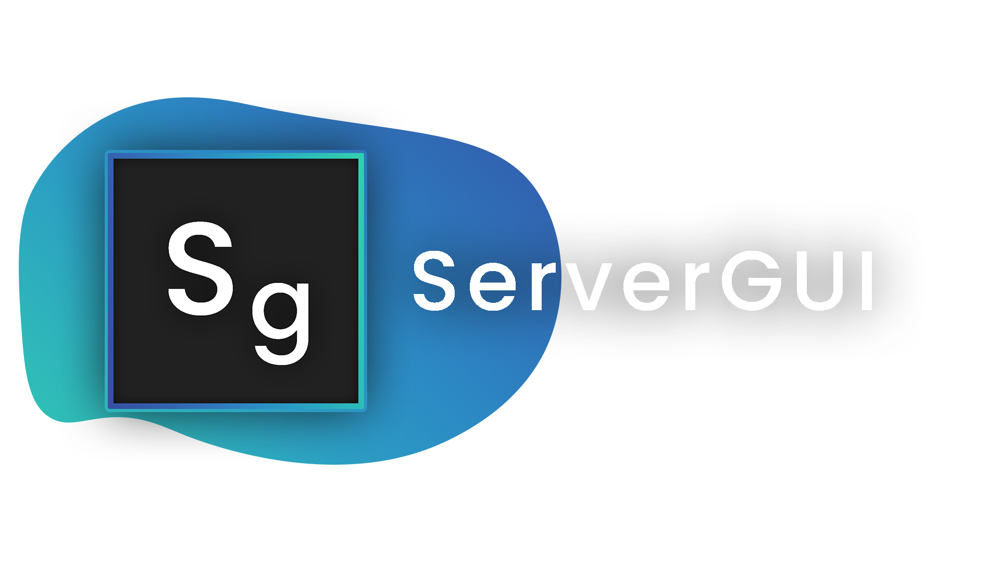

<!--
*** Thanks for checking out the Best-README-Template. If you have a suggestion
*** that would make this better, please fork the repo and create a pull request
*** or simply open an issue with the tag "enhancement".
*** Don't forget to give the project a star!
*** Thanks again! Now go create something AMAZING! :D
-->

<!-- PROJECT SHIELDS -->
<!--
*** I'm using markdown "reference style" links for readability.
*** Reference links are enclosed in brackets [ ] instead of parentheses ( ).
*** See the bottom of this document for the declaration of the reference variables
*** for contributors-url, forks-url, etc. This is an optional, concise syntax you may use.
*** https://www.markdownguide.org/basic-syntax/#reference-style-links
-->

[comment]: <> ([![Contributors][contributors-shield]][contributors-url])

[comment]: <> ([![Forks][forks-shield]][forks-url])

[comment]: <> ([![Stargazers][stars-shield]][stars-url])

[comment]: <> ([![Issues][issues-shield]][issues-url])

[comment]: <> ([![MIT License][license-shield]][license-url])

[comment]: <> ([![LinkedIn][linkedin-shield]][linkedin-url])

<!-- PROJECT LOGO -->
 

  

<h3 align="center">ServerGUI [Velocity]</h3>

  

    A GUI for server selection!
     
    <a href="https://github.com/Matt-MX/ServerGUI/releases"><strong>Download »</strong></a>
     
     
    <a href="https://github.com/Matt-MX/ServerGUI/issues">Report Bug</a>
    ·
    <a href="https://github.com/Matt-MX/ServerGUI/issues">Request Feature</a>
  

<!-- ABOUT THE PROJECT -->
## Features

[comment]: <> ([![Product Name Screen Shot][product-screenshot]]&#40;https://example.com&#41;)

Allow your players to use a GUI to select their server!
Customizable and intuitive design, and easy to use!

(<a href="#top">back to top</a>)

### Setup

Firstly, head over to [the release page](https://github.com/Matt-MX/ServerGUI/releases) and
download the latest version of the plugin. Drag the downloaded jar file into your
plugins folder in your Velocity server.

We also require you to install [Protocolize](https://github.com/Exceptionflug/protocolize) - it's how we are able to provide GUI support!
* [Protocolize](https://github.com/Exceptionflug/protocolize)

(<a href="#top">back to top</a>)

<!-- GETTING STARTED -->
## Getting Started

Simply alter anything in the `config.yml` and `messages.yml` that is generated located in `./plugins/servergui/...`.

Make sure users have permission node `servergui.commands.server` to run the `/server` command.

To reload the config, give yourself the permission `servergui.commands.reload`.

(<a href="#top">back to top</a>)

<!-- LICENSE -->
## License

Distributed under the MIT License.

(<a href="#top">back to top</a>)

<!-- CONTACT -->
## Contact

MattMX - [MattMX#0033](https://discord.gg)

Project Link: [https://github.com/Matt-MX/ServerGUI](https://github.com/Matt-MX/ServerGUI)

(<a href="#top">back to top</a>)

<!-- ACKNOWLEDGMENTS -->
## Acknowledgments

* [Protocolize](https://github.com/Exceptionflug/protocolize)
* [Velocity](https://velocitypowered.com/)

(<a href="#top">back to top</a>)

<!-- MARKDOWN LINKS & IMAGES -->
<!-- https://www.markdownguide.org/basic-syntax/#reference-style-links -->

[comment]: <> ([contributors-shield]: https://img.shields.io/github/contributors/othneildrew/Best-README-Template.svg?style=for-the-badge)

[comment]: <> ([contributors-url]: https://github.com/othneildrew/Best-README-Template/graphs/contributors)

[comment]: <> ([forks-shield]: https://img.shields.io/github/forks/othneildrew/Best-README-Template.svg?style=for-the-badge)

[comment]: <> ([forks-url]: https://github.com/othneildrew/Best-README-Template/network/members)

[comment]: <> ([stars-shield]: https://img.shields.io/github/stars/othneildrew/Best-README-Template.svg?style=for-the-badge)

[comment]: <> ([stars-url]: https://github.com/othneildrew/Best-README-Template/stargazers)

[comment]: <> ([issues-shield]: https://img.shields.io/github/issues/othneildrew/Best-README-Template.svg?style=for-the-badge)

[comment]: <> ([issues-url]: https://github.com/othneildrew/Best-README-Template/issues)

[comment]: <> ([license-shield]: https://img.shields.io/github/license/othneildrew/Best-README-Template.svg?style=for-the-badge)

[comment]: <> ([license-url]: https://github.com/othneildrew/Best-README-Template/blob/master/LICENSE.txt)

[comment]: <> ([linkedin-shield]: https://img.shields.io/badge/-LinkedIn-black.svg?style=for-the-badge&logo=linkedin&colorB=555)

[comment]: <> ([linkedin-url]: https://linkedin.com/in/othneildrew)

[comment]: <> ([product-screenshot]: images/screenshot.png)
